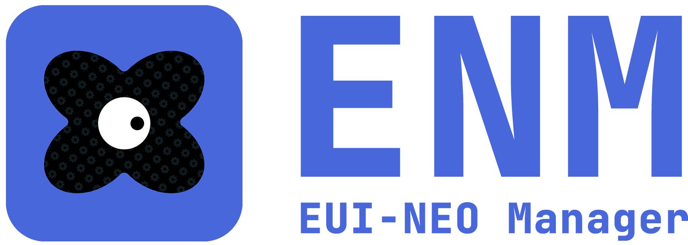

<div align="center">
  
</div>

<br/>

<div align="center">
  <strong>ENM - 更轻松地安装 EUI-NEO SDK、创建应用并打包</strong>
</div>

<br/>

<div align="center">
  <a href="https://github.com/sudoevolve/EUI-NEO"></a>
  <a href="https://sudoevolve.github.io/EUI-NEO/"></a>
</div>

<div align="center">
  
  
  
  
</div>

---

ENM 是一个非官方的 EUI-NEO 命令行工具。它帮你完成 SDK 下载、环境检查、应用创建、构建和打包，不需要把自己的应用放进 EUI-NEO 源码目录。

> [!IMPORTANT]
> ENM 会直接读取 EUI-NEO 的 [GitHub Releases](https://github.com/sudoevolve/EUI-NEO/releases)。版本列表、最新版和下载地址都来自上游，不需要等待 ENM 更新版本表。

## ✨ 能做什么

- 查看可用的 EUI-NEO 版本
- 下载并切换不同版本的 SDK
- 检查电脑是否具备构建条件
- 一条命令创建新的 EUI-NEO 应用
- 配置、构建和简单测试应用
- 整理运行文件并生成 ZIP 或 tar.gz
- 按需创建 GitHub Actions

## 🚀 快速开始

### 准备环境

需要提前安装：

- Python 3.9 或更高版本
- CMake 3.14 或更高版本
- Windows：Visual Studio 2022 Build Tools，并勾选 C++ 桌面开发工具
- 能正常访问 GitHub

Vulkan SDK 不是默认必需项。普通项目默认使用 OpenGL；只有你主动选择 Vulkan 时才需要安装它。

### 安装 ENM

ENM 不提供独立 EXE。你可以下载完整源码，也可以只保留两个安装器文件。

#### 方式一：下载完整源码

适合需要离线保存源码、查看实现或之后重新安装的用户。

1. 打开 [ENM Releases](https://github.com/MRoldL001/ENM/releases)，选择需要的版本。
2. 展开 `Assets`，下载 GitHub 自动生成的 `Source code (zip)`。
3. 完整解压 ZIP。
4. 进入解压后的目录，双击 `install.cmd`。
5. 选择 `Install ENM from this folder`。

安装器会确认当前目录包含 `pyproject.toml` 和 `src/enm` 等必要文件，然后从本地源码安装。安装完成后，下载和解压的源码都不会被删除。

#### 方式二：只下载安装器

适合只想安装和使用 ENM、不想长期保存完整源码的用户。

1. 下载 [`install.cmd`](https://raw.githubusercontent.com/MRoldL001/ENM/main/install.cmd)。
2. 下载 [`install.ps1`](https://raw.githubusercontent.com/MRoldL001/ENM/main/install.ps1)。
3. 保持文件名不变，并把两个文件放进同一个文件夹。
4. 双击 `install.cmd`。
5. 选择 `Download ENM from GitHub Releases`，再用方向键选择版本并按 Enter。

两个安装器文件必须同时存在，因为 `install.cmd` 会启动同目录下的 `install.ps1`。联网安装会下载所选 Release 的 `Source code (zip)`，在系统临时目录中解压并安装；无论成功还是失败，临时下载和解压文件都会被清理。你手动下载的 `install.cmd` 和 `install.ps1` 不会被删除。

#### 从 PowerShell 启动

无论采用哪种下载方式，也可以在安装器所在目录打开 PowerShell：

```powershell
.\install.ps1
```

安装界面的两个选项分别表示：

- `Install ENM from this folder`：检查安装器所在目录是否包含完整 ENM 源码，然后从本地安装；不会删除本地源码。
- `Download ENM from GitHub Releases`：读取 [ENM Releases](https://github.com/MRoldL001/ENM/releases)，继续使用方向键选择版本，再下载该 Release 自动生成的 `Source code (zip)`。源码会被临时解压，并在安装结束后删除。

也可以跳过交互选择，直接指定网络版本：

```powershell
.\install.ps1 -Source GitHub -Version 0.1.0
```

完成后请打开一个新终端并确认：

```powershell
enm --version
enm doctor
```

安装器会比较源码包与本机已安装的 ENM 版本。源码包版本更低时会拒绝降级；相同版本允许重新安装。这个限制只针对 ENM 自身，不影响安装或切换旧版 EUI-NEO SDK。

> [!WARNING]
> 只有完整解压 Release 源码后才能选择本地安装。只下载两个安装器文件时必须选择 GitHub Releases，并保持网络可用。

卸载：

```powershell
.\uninstall.ps1
```

也可以直接从源码安装：

```powershell
python -m pip install -e .
```

## 📦 安装 EUI-NEO SDK

先查看版本：

```powershell
enm sdk list
```

只查看某个版本：

```powershell
enm sdk list v0.5.6
```

示例输出：

```text
VERSION            PUBLISHED    HOST SDK INSTALLED ACTIVE
v0.5.6             2026-08-10   yes      yes       *
v0.5.5             2026-08-02   yes      no
```

- `HOST SDK`：该版本是否提供适合当前电脑的 SDK
- `INSTALLED`：是否已经安装到本机
- `ACTIVE`：星号表示当前使用的版本

只查看本机已经安装的 SDK（不访问网络）：

```powershell
enm sdk installed
```

示例输出：

```text
VERSION            ACTIVE  PATH
v0.5.6             *       C:\Users\name\AppData\Local\enm\sdks\v0.5.6\windows-x64
v0.5.5                     C:\Users\name\AppData\Local\enm\sdks\v0.5.5\windows-x64
```

安装最新版：

```powershell
enm sdk install latest
```

安装或切换指定版本：

```powershell
enm sdk install v0.5.5
enm sdk use v0.5.5
```

查看当前 SDK 的位置：

```powershell
enm sdk path
```

删除不再需要的版本时，必须明确写出版本号：

```powershell
enm sdk uninstall v0.5.5
```

命令不接受空版本。当前激活的 SDK 默认不能删除；请先用 `enm sdk use` 切换，或在确认后添加 `--force`。强制删除当前版本后将不再有激活版本。

下载完成后，ENM 会核对文件摘要。不同版本可以同时保留，切换版本不会覆盖其他 SDK。

## 🪄 创建第一个应用

```powershell
enm init "My App" --path my-app
cd my-app
enm configure
enm build
```

程序通常位于：

```text
my-app/build/default/Release/My_App.exe
```

生成的项目会记住创建时选择的 EUI-NEO 版本。以后即使你切换了全局 SDK，这个项目仍会继续使用原来的版本，除非手动修改 `enm-project.json`。

ENM 会按 SDK 的实际内容选择接入方式。提供 `eui_neo_configure_app()` 的新版 SDK 直接使用上游统一入口；只导出 `eui::neo` 的旧版 SDK 会自动下载并缓存同标签的上游源码，用其中匹配的 GLFW/SDL2 入口补齐构建。首次配置旧 SDK 需要联网，之后可以使用缓存离线构建；判断依据不是写死的版本号。

`enm-project.json` 是项目名称、项目版本、构建目标和 EUI-NEO 版本的唯一配置源。`enm configure` 会在构建目录生成临时的 `enm-config.cmake` 供 CMake 使用，不需要在 `CMakeLists.txt` 中重复维护这些值。

项目使用 EUI-NEO 官方外部应用接口，并将源码单独放在 `src/`：

```text
my-app/
├─ src/
│  └─ app.cpp
├─ tests/
│  └─ app_config_test.cpp
├─ CMakeLists.txt
├─ enm-project.json
└─ .gitignore
```

默认测试通过应用实际导出的 `dslAppConfig()` 检查标题、页面 ID 和窗口尺寸。项目变大后，可以按上游应用的组织方式自行加入 `assets/`、`components/` 和 `pages/`。

### 后续操作

```powershell
enm test
enm deploy
enm package --format zip
```

- `test`：单独构建测试程序，再通过 CTest 运行登记的测试；普通 `build` 不构建测试
- `deploy`：把程序、资源和需要随程序提供的文件整理到 `dist/`
- `package`：无论成功失败都会删除临时部署目录；成功时只保留压缩包与 `.sha256`，需要展开目录请使用 `deploy`
- `package`：把整理后的目录压缩，并附带 `.sha256` 校验文件

## 🩺 关于环境检查

运行：

```powershell
enm doctor
```

输出标记：

- `OK`：已找到并可使用
- `--`：可选项目未找到，通常不影响当前操作
- `!!`：需要处理的问题
- `??`：暂时无法确认，例如 Visual Studio 正在安装或更新

如果提示 `msvc-sdk-abi` 不兼容，请先通过 Visual Studio Installer 更新 Visual Studio 2022 Build Tools，然后删除项目的 `build` 目录并重新构建：

```powershell
Remove-Item -Recurse -Force .\build
enm configure
enm build
```

## 🤖 可选：GitHub Actions

`enm init` 默认不会创建 `.github/`。如果你确实需要 GitHub Actions，可以在项目目录中运行：

```powershell
enm ci init github `
  --install-spec "git+https://github.com/OWNER/enm.git@TAG"
```

也可以在创建项目时一起生成：

```powershell
enm init "My App" --path my-app --ci github `
  --install-spec "git+https://github.com/OWNER/enm.git@TAG"
```

请把 `OWNER` 和 `TAG` 换成真实的仓库所有者和版本标签。由于 ENM 尚未发布到 Python 包索引，这里必须提供 GitHub Actions 能访问的 ENM 仓库或 wheel 地址。

## 🔧 命令列表

| 命令                          | 用途                   | 常用选项或参数                            |
| --------------------------- | -------------------- | ---------------------------------- |
| `enm doctor`                | 检查本机环境和当前 SDK        | `--json` 输出 JSON                   |
| `enm sdk list [VERSION]`    | 查看全部版本或指定版本的状态       | `--include-prerelease`、`--json`    |
| `enm sdk installed`         | 查看当前电脑已安装的 SDK       | `--json` 输出 JSON                   |
| `enm sdk install [VERSION]` | 下载并激活 SDK，省略版本时使用最新版 | `latest`、`vX.Y.Z`                  |
| `enm sdk use VERSION`       | 切换当前 SDK             | `vX.Y.Z`                           |
| `enm sdk path`              | 显示当前 SDK 的本地路径       | -                                  |
| `enm sdk uninstall VERSION` | 删除明确指定的本地 SDK        | 删除已启用的 SDK 需先切换，或明确使用 `--force`    |
| `enm init NAME`             | 创建新应用                | `--path`、`--version`、`--ci github` |
| `enm configure`             | 为当前项目准备构建环境          | `-- CMAKE_ARGS...`                 |
| `enm build`                 | 构建当前项目               | `-- BUILD_ARGS...`                 |
| `enm test`                  | 运行项目登记的 CTest 测试     | `-- CTEST_ARGS...`                 |
| `enm deploy`                | 把运行文件整理到 `dist/`     | `--binary`、`--force`               |
| `enm package`               | 打包运行目录并生成校验文件        | `--format zip` 或 `--format tar.gz` |
| `enm ci init github`        | 创建 GitHub Actions    | `--install-spec SPEC`              |

每个命令都可以使用 `--help` 查看完整选项，例如：

```powershell
enm sdk install --help
```

## 🧩 给开发者

以下实现细节会影响兼容、扩展或排错：

- 版本列表、下载地址和文件摘要来自 EUI-NEO GitHub Releases API，没有内置版本表。
- SDK 按版本和平台分别保存在 ENM 状态目录中；可用 `ENM_HOME` 或全局参数 `--home` 更改位置。
- 项目通过 `enm-project.json` 固定 EUI-NEO 版本，构建时使用该版本，而不是直接跟随当前激活版本。
- 生成项目优先调用上游公开的 `find_package(EuiNeo)`、`eui::neo` 和 `eui_neo_configure_app()`；旧 SDK 则使用同版本上游源码中的兼容入口。
- Windows ABI 检查会比较 SDK 与本机 MSVC 运行库实际包含的 `__std_*` 符号，不使用写死的 Visual Studio 最低版本；它是提前发现问题的辅助检查，不能证明所有二进制组合都兼容。
- `enm configure` 和 `build` 最终调用 CMake；`enm test` 仅在项目自行登记测试后调用 CTest。额外参数可放在 `--` 后传递。

从源码参与开发时可使用：

```powershell
python -m pip install -e .
python -m unittest discover -s tests -v
```

## ⚠️ 当前状态

- ENM 仍处于实验阶段，当前版本为 `0.1.0`
- 主要在 Windows x64 上进行了实际验证
- Linux 与 macOS 支持尚未经过同等程度的测试
- 不会自动安装编译器、Visual Studio、CMake 或 Vulkan SDK
- 不会为发布包签名，也不会制作 MSI 等系统安装包
- 上游预编译 SDK 仍可能与本机编译器不兼容，ENM 会尽量提前提示

## 📄 非官方声明

ENM 是由独立开发者制作的第三方工具，与 EUI-NEO 作者没有隶属、授权或官方合作关系。EUI-NEO 的名称、代码和发布文件归各自权利人所有。

## 📜 许可证

ENM 使用 [MIT License](LICENSE)。EUI-NEO 及其依赖仍使用各自的许可证。
